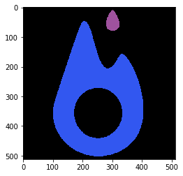
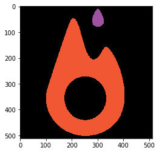
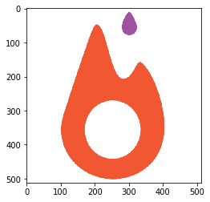

I recently got my copy of Practical Python and OpenCV by Adrian Rosebrock.  So far, I really enjoy the book.

Unfortunately, I cannot say the same about OpenCV itself. I just don't like it. My reasons may be superficial, but they're enough to derail my enthusiasm.  Here are the top three:

1. I have to read instructions to install it. 
2. The use of camelCase in python triggers me.
3. It makes me feel stupid because I don't already know it. 

Luckily, I can use my bad attitude as a tool for learning computer vision. As I learn how to perform essential computer vision techniques in OpenCV, I will find (hopefully) better ways to do the same things without OpenCV.

# Challenge 1: Read and display an image
Reading images looks super easy.  cv2 has a function called imread that returns a numpy array.


```python
import cv2
img = cv2.imread('./pytorch.png')
print(img.shape)
```

    (512, 512, 3)


The array is 512x512 pixels with the usual 3 color channels.  Simple enough.  Let's take a look at the image.  OpenCV has a imshow function, but I can't make that render in my Jupyter notebook so I'll use matplotlib.pyplot instead.


```python
plt.imshow(img)
```


    <matplotlib.image.AxesImage at 0x7f064ca537f0>





Wait, what the hell?  Those colors are completely wrong.  It's supposed to be an orange flame on a white background.  

It turns out opencv returns pixel values in the order (BLUE, GREEN, RED) but matplotlib expects them to be (RED, GREEN, BLUE).  No worries, I can just flip the color axis.


```python
img_rgb = img[:, :, [2,1,0]]
plt.imshow(img_rgb)
```


    <matplotlib.image.AxesImage at 0x7f064c9e6a90>





Now the flame is the correct color, but the background is still black.  Why is this so hard?  

It's hard because my image actually doesn't have a white background. It actually has a black background with opacity 0.  Zero opacity allows consumers of the image to place the logo part of the picture on whatever background they want.  For example, I could use photoshop to make it look like I got a pytorch tatoo on my ass for April Fools Day.  It's a lot more believable if you can see skin in the middle part of the logo.  We usually store opacity in a fourth channel, but opencv returned an array with 3 channels.  It only took a couple of googles to learn how to tell opencv not to strip the alpha channel.  All I have to do is pass imread this flag that the docstring doesn't mention.


```python
img = cv2.imread("./pytorch.png", cv2.IMREAD_UNCHANGED)
img_rgb = img[:, :, [2,1,0,3]]
img.shape
```


    (512, 512, 4)


```python
plt.imshow(img_rgb)
```


    <matplotlib.image.AxesImage at 0x7f064c9ccb38>





Finally!  The logo is the  correct color and the background matches my white jupyter notebook (which would totally be black if I could get dark themes to look good with jupyter-vim-binding)

Let's see if we can pull this off with the imageio module...


```python
img = imageio.imread('./pytorch.png')
plt.imshow(img)
print(img.shape)
```

    (512, 512, 4)


Immediately, I get the results I was expecting.

I have to admit though, It's kind of cool that OpenCV forced me to not take the color channels for granted.  

- I have no good arguments why the color channels should go Red, Green, Blue instead of any other order 
- I suppose I can start to guess why an image library wouldn't want to return the alpha channel by default. Perhaps it messes up memory layout and causes other functions in the library to malfunction?  Perhaps I won't want the alpha channel in the future? 

That's all the time I budgeted for writing tonight, so I'll have to wrap this up.  Hopefully in part 2 we can get to actually do something with images. 
